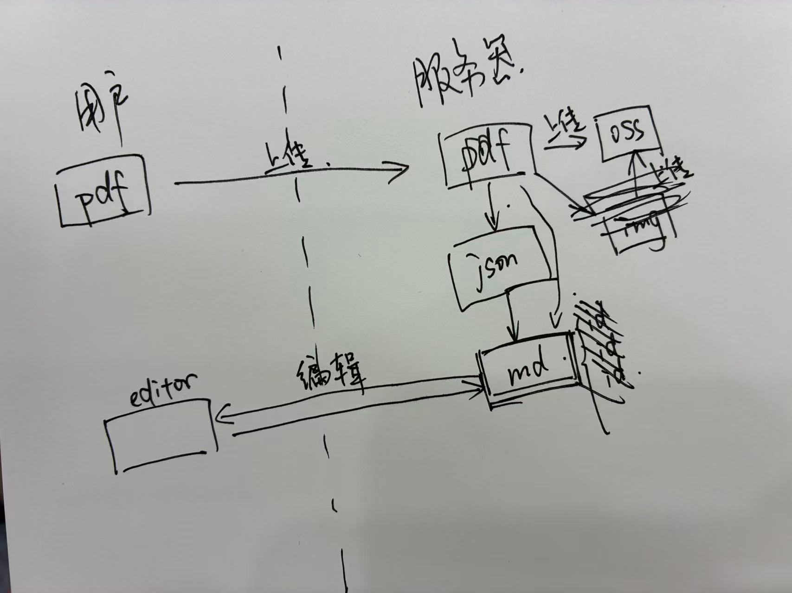

# bc-backend

Spring Boot 后端应用 - 职业规划平台

## 🚀 快速开始

### 环境要求
- Java 17+
- Maven 3.6+
- Docker & Docker Compose

### 本地开发

1. **启动依赖服务**
   ```bash
   docker compose up -d
   ```

2. **配置环境变量**
   ```bash
   # 复制环境变量模板
   cp .env.properties src/main/resources/.env.properties

   # 编辑 src/main/resources/.env.properties 文件，填入您的实际配置
   # 需要配置：API密钥、数据库密码、OSS凭据等
   ```

3. **运行应用**
   ```bash
   mvn spring-boot:run -Dspring.profiles.active=local
   ```

4. **使用便捷启动脚本**（推荐）
   ```bash
   ./start-local.sh
   ```

### 环境配置

应用支持以下环境配置：
- `local` - 本地开发环境
- `ci` - CI/CD 环境
- `prod` - 生产环境

敏感配置通过环境变量管理：
- API密钥 (DeepSeek, OpenAI)
- JWT密钥
- 数据库密码
- OSS凭据

## 🔧 开发

### 构建
```bash
mvn clean compile
```

### 测试
```bash
mvn test
```

### 打包
```bash
mvn package
```

## 📦 部署

### Docker
```bash
docker build -t bc-backend .
docker run -p 8080:8080 bc-backend
```

### CI/CD
项目使用 GitHub Actions 自动构建和推送 Docker 镜像到 GitHub Packages。

## 🔐 安全说明

- 所有敏感信息通过环境变量配置
- 配置文件模板不包含真实密钥
- 生产环境密钥通过 GitHub Secrets 管理

## 📋 任务看板

1. feed流推送
2. redis缓存
3. 知识库构建
4. 数据展示
5. 大模型聊天页面 -> 规划中心
6. 接mcp （有余力）
7. 大模型画学习路径图
8. Grafana监控（或者其他）


